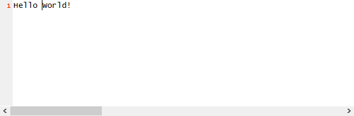
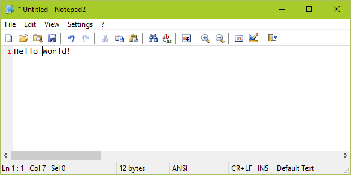

This is an example on how to use [TestStack.White](https://github.com/TestStack/White) to automate a native Windows Application.

White lets us automate (or unit test) an application using C# code. For example, You can send keystrokes and take screenshots:

```csharp
// send text keystrokes.
window.Keyboard.Enter("Hello World!");

// send key combinations.
window.Keyboard.PressSpecialKey(KeyboardInput.SpecialKeys.HOME);
window.Keyboard.HoldKey(KeyboardInput.SpecialKeys.CONTROL);
window.Keyboard.PressSpecialKey(KeyboardInput.SpecialKeys.RIGHT);
window.Keyboard.LeaveKey(KeyboardInput.SpecialKeys.CONTROL);

// take a screenshot.
var textPane = window.Get<TextBox>();
using (var image = textPane.VisibleImage)
{
    image.Save("screenshot.png");
}
```

See the [complete example](AutomateNotepad/Program.cs) and the White [Getting Started Guide](http://white.teststack.net/docs/getting-started).

To automate an application you'd normally need to known its UI tree. For that you can use these tools:

* **UIAVerify**.
  It comes with the [Windows SDK](https://developer.microsoft.com/en-us/windows/downloads/windows-8-1-sdk) and is normally installed at `C:\Program Files (x86)\Windows Kits\8.1\bin\x64\UIAVerify\VisualUIAVerifyNative.exe`.
* **Spy++**.
  It comes with [Visual Studio](https://www.visualstudio.com/en-us/products/visual-studio-community-vs.aspx) and is normally installed at `C:\Program Files (x86)\Microsoft Visual Studio 14.0\Common7\Tools\spyxx.exe` (and `spyxx_amd64.exe`).

## example screenshots

just the edit control:



the entire window:


